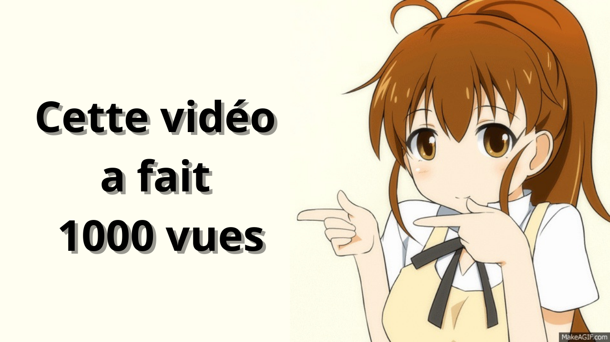

# Générateur de Miniatures YouTube avec Compteur de Vues

Ce projet permet de mettre à jour une vidéo Youtube avec comme titre "Cette vidéo a fait XXX vues".<br/>
Et ce texte aussi écrit sur une image qui sert de base nommé "base_image.png".<br/>
XXX correspondant au nombre de vues de cette vidéo Youtube.<br/>

Source image de base : https://imgur.com/D58V0IM <br/>
Vidéo Youtube tutoriel : https://www.youtube.com/watch?v=7Al7N3CGlVw

## 📋 Prérequis

### Compte Google et API YouTube

[Documentation](https://developers.google.com/youtube/v3/getting-started)

1. Créez un projet dans la [Google Developer Console](https://console.cloud.google.com/)
2. Activez l'API YouTube Data v3
3. Configurez l'écran de consentement OAuth (Préciser les permissions dont l'application aura besoin, S'ajouter en tant qu'utilisateur pouvant accéder à l'app)
4. Créez des identifiants OAuth 2.0 pour une application de bureau
5. Téléchargez le fichier JSON des identifiants et renommez-le en `clients.json`

### Image personnalisée

Préparez une image qui servira de base "base_image.png", elle doit correspondre aux critères de Youtube (≤ 2 MB) et 1280x720 de résolution.

## 💻 Installation

1. Clonez ce dépôt :

```bash
git clone https://github.com/Crisxzu/youtube-video-views-count
cd youtube-video-views-count
```

2. Installez les dépendances :

```bash
pip install -r requirements.txt
```

3. Placez votre fichier `clients.json` dans le répertoire du projet

4. Placez votre image `base_image.png` dans le répertoire du projet

5. Créer un fichier variable environnement ".env" avec ces éléments. Vous pouvez aussi copier le fichier ".env.example".

```env
VIDEO_ID =
PORT = 10010
COOLDOWN_SECONDS = 900
```

## 🚀 Utilisation

```bash
python main.py
```

## ⚙️ Personnalisation

### Police
Modifiez la variable `font_path` :

```python
font_path = "OpenSans-Bold.ttf"
```

### Couleur du texte

Modifiez la variable `text_color` pour la couleur du texte de base et la variable `shadow_color` pour l'ombre.

```python
text_color = (0, 0, 0) # Noir
shadow_color = (153, 152, 145) # Gris
```

### Position du texte

Modifiez les variables `text_position` et `shadow_offset` pour la position du texte et celle de son ombre par rapport à celle du texte

```python
text_position = (50, 100)
shadow_offset = (8, 8)
```

## 📸 Exemple de résultat



La miniature générée affichera le nombre de vues en haut avec un effet d'ombre et votre image de base.

## 🔑 Gestion des tokens

Le script stocke les tokens d'authentification dans le fichier `youtube_token.pickle`. <br/>
Ce fichier permet de ne pas avoir à se réauthentifier à chaque utilisation. <br/>
Pour forcer une nouvelle authentification, supprimez simplement ce fichier. <br/>

## ⚠️ Limitations

- YouTube limite la taille des miniatures à 2 Mo
- Les formats acceptés sont JPG, PNG 
- Vous devez être le propriétaire de la vidéo ou avoir les droits d'édition
- L'API YouTube a des quotas d'utilisation quotidiens (le projet utilise 101 points par cycle)

## 📄 Licence

Ce projet est sous licence MIT. Consultez le fichier [LICENSE](LICENSE) pour plus de détails.

---

Créé avec ❤️ par Dazu